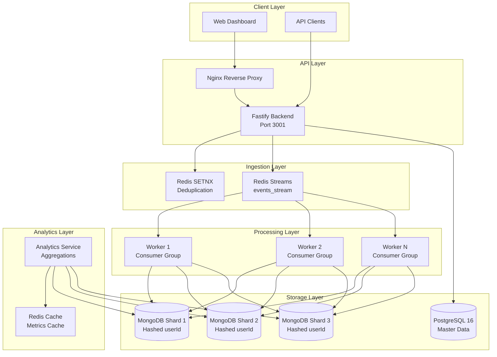
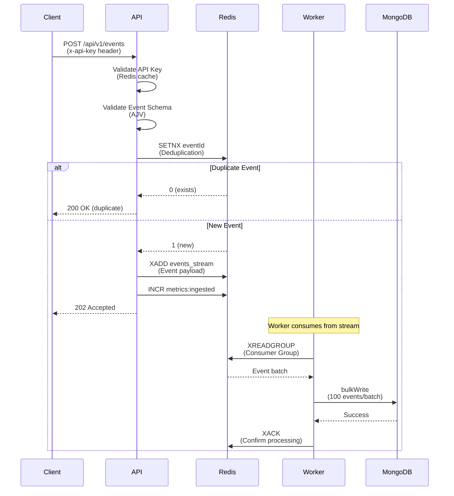
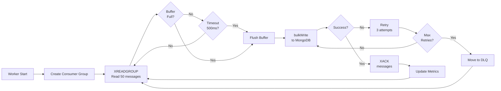

# Event Processor - Architecture Documentation

## Overview

Event Processor is a high-scale distributed event processing system designed to handle **50,000 events per second (EPS)** with horizontal scalability, fault tolerance, and real-time analytics capabilities.

## System Architecture

### High-Level Architecture Diagram



## Data Flow

### Event Ingestion Flow



### Worker Processing Flow



## Technical Decisions

### Why Redis Streams?

**Decision**: Use Redis Streams for event ingestion buffer instead of message queues like RabbitMQ or Kafka.

**Rationale**:
- **Low Latency**: Redis Streams provides sub-millisecond latency for writes, critical for 50k EPS
- **Consumer Groups**: Built-in support for distributed processing with exactly-once semantics
- **Simplicity**: Single infrastructure component (Redis) handles caching, deduplication, and streams
- **Cost-Effective**: No additional infrastructure needed for moderate scale
- **Persistence**: Optional AOF/RDB persistence for durability

**Trade-offs**:
- Memory-bound (events must fit in Redis memory)
- Less feature-rich than Kafka for very high throughput (>100k EPS)
- Single point of failure (mitigated with Redis Cluster in production)

### Why MongoDB Sharding?

**Decision**: Use MongoDB Sharded Cluster with hashed sharding on `userId`.

**Rationale**:
- **Horizontal Scalability**: Distribute data across multiple shards to handle billions of events
- **Hashed Sharding**: Ensures uniform distribution of events across shards
- **Query Performance**: Sharding key (`userId`) enables efficient queries and aggregations
- **High Availability**: Replica sets provide automatic failover
- **Native Aggregation**: MongoDB aggregation pipeline optimized for analytics queries

**Sharding Strategy**:
- **Shard Key**: `hashed(userId)` - ensures even distribution
- **Chunk Size**: 64MB (default) - balanced between migration overhead and distribution
- **Indexes**: Compound indexes on `(timestamp, eventType)` and `(userId, timestamp)` for query optimization

**Trade-offs**:
- Complex setup and maintenance
- Requires careful index design
- Cross-shard queries are slower (mitigated by proper shard key selection)

### Why Fastify?

**Decision**: Use Fastify instead of Express.js for the HTTP server.

**Rationale**:
- **Performance**: 2-3x faster than Express due to schema-based validation and async/await optimization
- **Schema Validation**: Built-in JSON Schema validation reduces overhead
- **TypeScript Support**: Excellent TypeScript support out of the box
- **Plugin Ecosystem**: Modular architecture with fastify plugins
- **Low Overhead**: Minimal middleware overhead for high-throughput scenarios

**Performance Comparison** (approximate):
- Express: ~15k req/s
- Fastify: ~40k req/s (with schema validation)

### Why PostgreSQL for Master Data?

**Decision**: Use PostgreSQL for users, API keys, and configuration data.

**Rationale**:
- **ACID Compliance**: Strong consistency guarantees for critical data
- **Relational Model**: Natural fit for user-API key relationships
- **Prisma ORM**: Excellent TypeScript integration and type safety
- **Mature Ecosystem**: Battle-tested for production workloads
- **Separation of Concerns**: Keep transactional data separate from event storage

## Scalability Strategy

### Horizontal Scaling Components

#### 1. API Layer (Backend)
- **Current**: Single instance
- **Scaling**: Stateless design allows horizontal scaling behind load balancer
- **Bottleneck**: None (stateless, Redis-backed caching)

#### 2. Worker Layer
- **Current**: 3-10 worker instances
- **Scaling**: Add more workers to increase processing throughput
- **Distribution**: Redis Consumer Groups automatically distribute work
- **Formula**: `Throughput = Workers × Batch Size × (1000ms / Batch Timeout)`
  - Example: 10 workers × 100 events × 2 batches/sec = **2,000 events/sec per worker**
  - **10 workers = 20,000 events/sec** (can scale to 50k EPS with 25 workers)

#### 3. MongoDB Shards
- **Current**: 3 shards
- **Scaling**: Add shards dynamically as data grows
- **Distribution**: Hashed sharding ensures even distribution
- **Capacity**: Each shard can handle ~10-15k writes/sec

### Performance Targets

| Metric | Target | Current Capacity |
|--------|--------|-----------------|
| Events Per Second | 50,000 | 20,000 (10 workers) |
| API Latency (p95) | < 50ms | ~30ms |
| Worker Latency | < 500ms | ~200ms |
| Deduplication | 100% | Redis SETNX |
| Data Consistency | Eventual | MongoDB replica sets |

### Bottleneck Analysis

1. **Redis Streams**: ~100k ops/sec per instance (sufficient)
2. **MongoDB Writes**: ~10-15k writes/sec per shard (scales with shards)
3. **Network**: Depends on infrastructure (Railway handles this)
4. **Worker CPU**: Batch processing minimizes CPU overhead

### Scaling Path to 50k EPS

```
Current: 10 workers × 2 batches/sec × 100 events = 2,000 EPS/worker = 20,000 EPS total
Target:  50,000 EPS

Required Workers: 50,000 / 2,000 = 25 workers
Required Shards: 50,000 / 15,000 = ~4 shards (with headroom)
```

## Fault Tolerance

### Failure Scenarios

1. **Worker Failure**
   - **Impact**: Pending messages remain in Redis Stream PEL (Pending Entry List)
   - **Recovery**: Other workers claim stale messages after 60s timeout
   - **Data Loss**: None (messages persist in Redis)

2. **MongoDB Shard Failure**
   - **Impact**: Writes to failed shard fail
   - **Recovery**: Replica set promotes secondary to primary
   - **Data Loss**: None (replica set ensures durability)

3. **Redis Failure**
   - **Impact**: New events cannot be ingested
   - **Recovery**: Redis persistence (AOF) allows recovery
   - **Data Loss**: Events in memory buffer may be lost (mitigated with persistence)

4. **API Failure**
   - **Impact**: Clients cannot ingest events
   - **Recovery**: Load balancer routes to healthy instances
   - **Data Loss**: None (events not yet accepted)

### Retry Strategy

- **Exponential Backoff**: Base delay 100ms, max 5s, with jitter
- **Max Retries**: 3 attempts for transient failures
- **Dead Letter Queue**: Persistent failures moved to `events_dlq` collection
- **Circuit Breaker**: Not implemented (consider for production)

## Data Consistency Model

### Eventual Consistency

- **Ingestion**: Immediate acknowledgment (202 Accepted) before persistence
- **Processing**: Workers process asynchronously with retries
- **Analytics**: Cache TTL of 10s ensures near-real-time metrics
- **Trade-off**: Acceptable for event analytics (not financial transactions)

### Idempotency

- **Mechanism**: Redis SETNX with 10-minute TTL
- **Key**: `dedup:event:{eventId}`
- **Guarantee**: Exactly-once processing per event ID

## Monitoring & Observability

### Metrics

- **Ingestion Rate**: `metrics:ingested` (Redis counter)
- **Duplicate Rate**: `metrics:duplicates` (Redis counter)
- **Worker Throughput**: Logged every 500 events
- **MongoDB Latency**: Tracked via aggregation `maxTimeMS`

### Logging

- **Format**: JSON (Pino.js) for production, Pretty for development
- **Levels**: trace, debug, info, warn, error, fatal
- **Structured Fields**: module, replicaId, railwayEnv

### Health Checks

- **API**: `/api/health` - Checks all database connections
- **Readiness**: `/api/ready` - Verifies services are ready
- **Liveness**: `/api/live` - Basic process health

## Security Considerations

### Authentication

- **API Keys**: SHA-256 hashed, cached in Redis (1-hour TTL)
- **JWT Tokens**: HS256 algorithm, 24-hour expiration
- **Rate Limiting**: 100 requests/minute per IP for auth endpoints

### Data Protection

- **Encryption in Transit**: TLS/SSL for all connections
- **Encryption at Rest**: MongoDB and PostgreSQL encryption
- **Secrets Management**: Environment variables (Railway secrets)

## Future Improvements

1. **Kafka Migration**: For >100k EPS, migrate to Kafka
2. **GraphQL API**: Add GraphQL layer for flexible queries
3. **Real-time Analytics**: WebSocket connections for live metrics
4. **Multi-region**: Deploy shards across regions for global scale
5. **Event Sourcing**: Implement event sourcing pattern for audit trail
